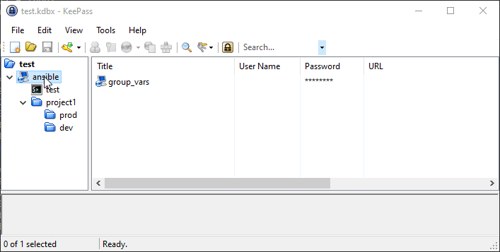
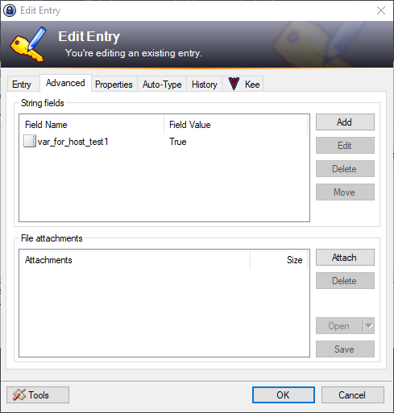

# snakems.ansible.keepass
### KeePass inventory source
- [Synopsis](#synopsis)
- [Requirements](#requirements)
- [Parameters](#parameters)
- [Using](#using)

## Synopsis
Get inventory hosts from KeePass database.

## Requirements  
The below requirements are needed on the local Ansible controller node that executes this inventory.
- pykeepass

## Parameters
Parammeter | Required | Description
--|--|--
keepass_database|Yes|Path to KeePass database 
keepass_key|No|Path to key-file.
keepass_pass|No|Pasword for KeePass database. If not set, it will be prompted 
keepass_root|Yes|Directory in KeePass Database from which to take hosts

## Using
### Config ansible.cfg
```
[defaults]
inventory = ./keepass_hosts.yaml
[inventory]
enable_plugins = keepass
```
### Config keepass_hosts.yaml
```
# Minimal example using environment vars or instance role credentials
# Fetch all hosts in root ansible. Password will be prompted
plugin: keepass
keepass_database: "test.kdbx"
keepass_root: "ansible"

# Example using key and predefined password. Set password in config not recommended
plugin: keepass
keepass_database: "test.kdbx"
keepass_pass: "123456"
keepass_key: "test.key"
keepass_root: "ansible"

# Example using encrypted password by ansible-vault
plugin: keepass
keepass_database: "test.kdbx"
keepass_pass: !vault |
          $ANSIBLE_VAULT;1.1;AES256
          35303030656130353330316138333833306364323664303534306532353230623737353937623563
          6137346636393733633335666261383535613033643835390a623262616632363461653765646534
          66343630333539326331306261393538316537356638376232663138366665336466316564386132
          6666313536323031370a626531626630316533356262646363333466383931316135396362353430
          6662
keepass_key: "test.key"
keepass_root: "ansible"
```
### KeePass Database


Use one of the options to add host data in field URL
```
<protocol>://<host>:<port>
# if protocol not set, by default using 'ssh'
<host>:<port> 
# if port not, by default using default port for selected protocol
<protocol>://<host>
<host>

# examples
ssh://10.10.0.2:22
winrm://10.10.0.3
10.0.0.4:2255 # using ssh on port 2255
```
For set vars using 'Tab Advanced' -> 'String Fields'  
  
If you want set group variables, create entry with name 'group_vars'  
'group_vars' in 'keepass_root' (in example is 'ansible') appling to group 'all'

### Checking inventory
```
$ ansible-inventory --graph --vars --ask-vault-password
Vault password:
@all:
  |--@project1:
  |  |--@dev:
  |  |  |--dev-1
  |  |  |  |--{ansible_connection = ssh}
  |  |  |  |--{ansible_host = 10.10.0.7}
  |  |  |  |--{ansible_password = 123456}
  |  |  |  |--{ansible_port = 22}
  |  |  |  |--{ansible_user = root}
  |  |  |  |--{var_for_group_all = True}
  |  |  |--dev-2
  |  |  |  |--{ansible_connection = ssh}
  |  |  |  |--{ansible_host = 10.10.0.8}
  |  |  |  |--{ansible_password = 210484}
  |  |  |  |--{ansible_port = 22}
  |  |  |  |--{ansible_user = root}
  |  |  |  |--{var_for_group_all = True}
  |  |--@prod:
  |  |  |--prod-1
  |  |  |  |--{ansible_connection = ssh}
  |  |  |  |--{ansible_host = 10.10.0.5}
  |  |  |  |--{ansible_password = 123456}
  |  |  |  |--{ansible_port = 22}
  |  |  |  |--{ansible_user = root}
  |  |  |  |--{var_for_group_all = True}
  |  |  |--prod-2
  |  |  |  |--{ansible_connection = ssh}
  |  |  |  |--{ansible_host = 10.10.0.6}
  |  |  |  |--{ansible_password = 123456}
  |  |  |  |--{ansible_port = 22}
  |  |  |  |--{ansible_user = root}
  |  |  |  |--{var_for_group_all = True}
  |  |--db
  |  |  |--{ansible_connection = ssh}
  |  |  |--{ansible_host = 10.10.0.4}
  |  |  |--{ansible_password = 123456}
  |  |  |--{ansible_port = 22}
  |  |  |--{ansible_user = root}
  |  |  |--{var_for_group_all = True}
  |--@test:
  |  |--test-1
  |  |  |--{ansible_connection = ssh}
  |  |  |--{ansible_host = 10.10.0.2}
  |  |  |--{ansible_password = 123456}
  |  |  |--{ansible_port = 22}
  |  |  |--{ansible_user = root}
  |  |  |--{var_for_group_all = True}
  |  |  |--{var_for_group_test = True}
  |  |  |--{var_for_host_test1 = True}
  |  |--test-2
  |  |  |--{ansible_connection = ssh}
  |  |  |--{ansible_host = 10.10.0.3}
  |  |  |--{ansible_password = 123456}
  |  |  |--{ansible_port = 22}
  |  |  |--{ansible_user = root}
  |  |  |--{var_for_group_all = True}
  |  |  |--{var_for_group_test = True}
  |  |--{var_for_group_test = True}
  |--@ungrouped:
  |--{var_for_group_all = True}

  ```